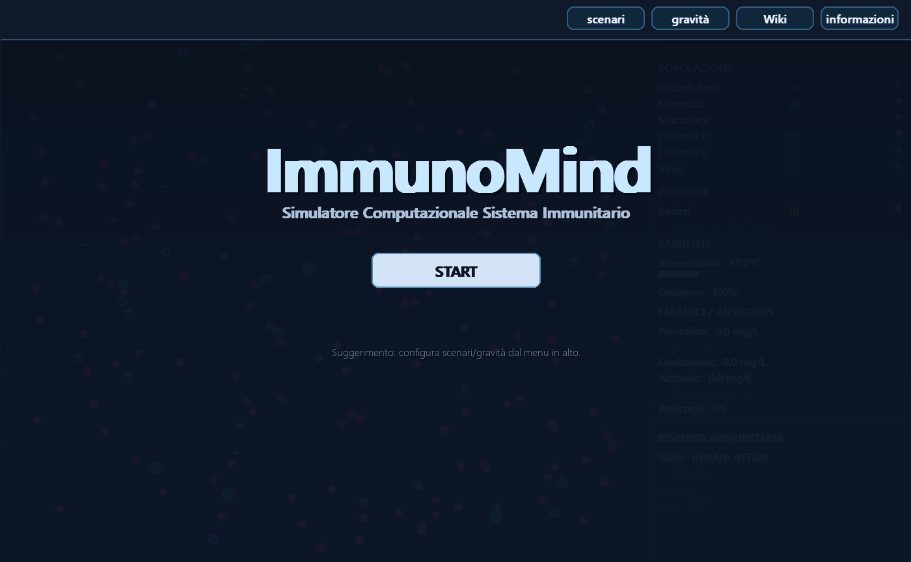
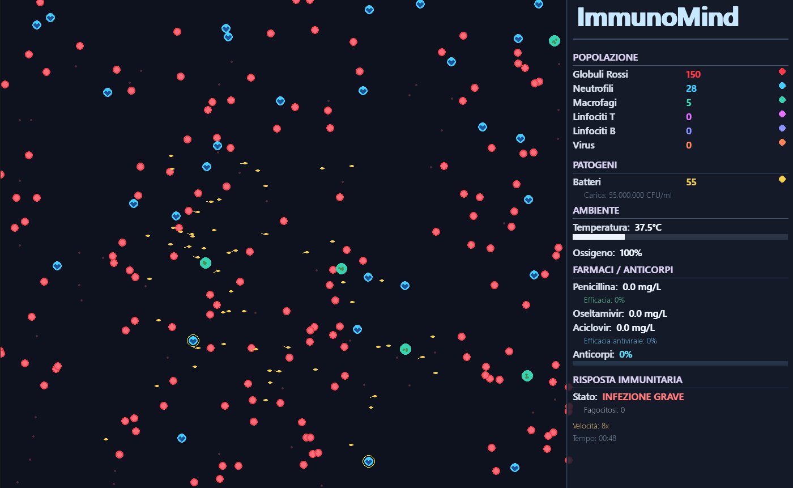
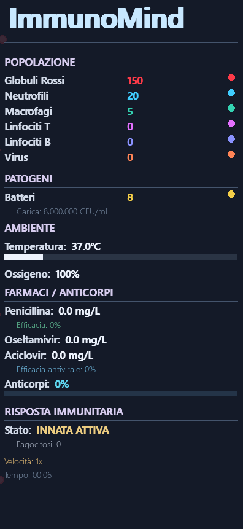

# ImmunoMind

**Simulatore interattivo del sistema immunitario umano**

Repository: [github.com/NovaCoding-G/ImmunoMind](https://github.com/NovaCoding-G/ImmunoMind)

[Italiano](#italiano) · [English](#english)

ImmunoMind è un'applicazione educativa in Python che visualizza, in tempo reale, l'interazione tra patogeni e difese immunitarie. Il modello è intenzionalmente semplificato: privilegia chiarezza didattica e feedback visivo rispetto alla fedeltà clinica.


---

## Italiano

### Panoramica

ImmunoMind simula dinamiche fondamentali dell'immunità innata e adattativa in un ambiente vascolare bidimensionale. L'utente può introdurre infezioni, somministrare farmaci, variare la gravità dello scenario e osservare l'evoluzione di popolazioni cellulari, temperatura corporea e risposta terapeutica.

**Destinatari:** studenti di biologia e medicina, docenti, appassionati di immunologia.

> **Nota:** ImmunoMind non è un software medico né un modello predittivo clinico.

### Anteprima

| Home | Simulazione | HUD |
|:----:|:-----------:|:---:|
|  |  |  |
| Menu principale | Scenario batterico attivo | Pannello informativo |


### Funzionalità principali

| Area | Descrizione |
|------|-------------|
| Simulazione visiva | Canvas animato con flusso sanguigno, cellule e patogeni |
| Risposta innata | Neutrofili e macrofagi con chemotassi e fagocitosi |
| Risposta adattativa | Linfociti T/B, anticorpi, memoria immunitaria |
| Patogeni | Batteri (*E. coli*) e virus con replicazione |
| Farmacologia | Penicillina, Oseltamivir, Aciclovir |
| Scenari | Batterica, virale, vaccino/memoria, ferita/infiammazione |
| Analytics | Export CSV e modalità batch headless |


### Controlli

| Tasto | Azione |
|-------|--------|
| `Spazio` | Pausa / Riprendi |
| `Esc` | Home |
| Click sinistro | Aggiunge patogeni |
| `1` / `2` / `3` | Penicillina / Oseltamivir / Aciclovir |
| `N` | +5 neutrofili |
| `+` / `-` | Velocità (1×–60×) |
| `R` | Reset |
| `F` | Schermo intero |
| `E` | Export CSV |

### Scenari

| Scenario | Patogeno | Focus |
|----------|----------|-------|
| Batterica | *E. coli* | Risposta innata, antibiotici |
| Virale | Virus | Antivirali, limiti antibiotici |
| Vaccino / Memoria | *E. coli* | Anticorpi, risposta accelerata |
| Ferita / Infiammazione | *E. coli* | Infiammazione e ambiente |

### Esportazione dati

- **Interattivo:** premere `E` durante la simulazione → CSV in `dati_esportati/`
- **Batch:** `python run_experiment.py --durata 7200 --repliche 10 --seed-base 100`

### Struttura progetto

```
ImmunoMind/
├── main.py              # Loop principale e UI
├── config.py            # Parametri e costanti
├── entita_base.py       # Cellule e patogeni
├── ambiente.py          # Ambiente e farmaci
├── hud.py               # Pannello informativo
├── analytics.py         # Logger CSV
├── run_experiment.py    # Simulazioni batch
├── WIKI.py              # Contenuti Wiki
├── fonts.py             # Tipografia UI
├── test_sistema.py      # Verifica installazione
├── docs/screenshots/    # Screenshot e log visivo
├── GUIDA_PRINCIPIANTI.md
├── SCENARI.md
└── requirements.txt
```

### Licenza

Licenza [MIT](LICENSE). © 2026 G.Roscino / NovaCoding.

## English 

### Overview

ImmunoMind is an educational Python application that visualizes, in real time, the interaction between pathogens and immune defenses. The model is deliberately simplified: it prioritizes teaching clarity and visual feedback over clinical fidelity.

**Audience:** biology and medical students, educators, immunology enthusiasts.

> **Note:** ImmunoMind is not medical software or a clinical predictive model.

### Preview

| Home | Simulation | HUD |
|:----:|:----------:|:---:|
|  |  |  |
| Main menu | Active bacterial scenario | Information panel |


### Key features

| Area | Description |
|------|-------------|
| Visual simulation | Animated canvas with blood flow, cells, and pathogens |
| Innate response | Neutrophils and macrophages with chemotaxis and phagocytosis |
| Adaptive response | T/B lymphocytes, antibodies, immune memory |
| Pathogens | Bacteria (*E. coli*) and viruses with replication |
| Pharmacology | Penicillin, Oseltamivir, Acyclovir |
| Scenarios | Bacterial, viral, vaccine/memory, wound/inflammation |
| Analytics | CSV export and headless batch mode |


### Controls

| Key | Action |
|-----|--------|
| `Space` | Pause / Resume |
| `Esc` | Home |
| Left click | Add pathogens |
| `1` / `2` / `3` | Penicillin / Oseltamivir / Acyclovir |
| `N` | +5 neutrophils |
| `+` / `-` | Speed (1×–60×) |
| `R` | Reset |
| `F` | Fullscreen |
| `E` | Export CSV |

### Scenarios

| Scenario | Pathogen | Focus |
|----------|----------|-------|
| Bacterial | *E. coli* | Innate response, antibiotics |
| Viral | Virus | Antivirals, antibiotic limits |
| Vaccine / Memory | *E. coli* | Antibodies, faster response |
| Wound / Inflammation | *E. coli* | Inflammation and environment |

### Biological model

- **Chemotaxis** — Leukocytes detect pathogens within a configurable radius.
- **Phagocytosis** — Contact-based elimination with probability and digestion time.
- **Pathogen replication** — Binary division with energy consumption.
- **Fever** — Body temperature rises with pathogen load.
- **Adaptive immunity** — Timed activation of T/B lymphocytes and antibody accumulation.
- **Pharmacodynamics** — Half-life decay and dose-dependent efficacy.

**Default time scale:** 1 real second ≈ 1 simulated minute (adjustable with `+` / `-`).

### Data export

- **Interactive:** press `E` during simulation → CSV in `dati_esportati/`
- **Batch:** `python run_experiment.py --durata 7200 --repliche 10 --seed-base 100`

### Project structure

```
ImmunoMind/
├── main.py              # Main loop and UI
├── config.py            # Parameters and constants
├── entita_base.py       # Cells and pathogens
├── ambiente.py          # Environment and drugs
├── hud.py               # Information panel
├── analytics.py         # CSV logger
├── run_experiment.py    # Batch simulations
├── WIKI.py              # Wiki content
├── fonts.py             # UI typography
├── test_sistema.py      # Installation check
├── docs/screenshots/    # Screenshots and visual log
├── GUIDA_PRINCIPIANTI.md
├── SCENARI.md
└── requirements.txt
```

### License

[MIT License](LICENSE). © 2026 G.Roscino / NovaCoding.

### Troubleshooting

| Issue | Solution |
|-------|----------|
| `ModuleNotFoundError: pygame` | `pip install --upgrade pygame` |
| Low performance | Reduce populations in `config.py`; lower simulation speed |
| Window size | Edit `LARGHEZZA` / `ALTEZZA` in `config.py` |
| No CSV on `E` | Run simulation for at least one log interval (default 30 sim. seconds) |

### References

- [Neutrophils — Wikipedia](https://en.wikipedia.org/wiki/Neutrophil)
- [Phagocytosis — Nature Reviews Immunology](https://www.nature.com/articles/nri2191)
- [*E. coli* — Wikipedia](https://en.wikipedia.org/wiki/Escherichia_coli)
- [Penicillin — Wikipedia](https://en.wikipedia.org/wiki/Penicillin)

-NovaCoding (G.Roscino) — [Repository GitHub](https://github.com/NovaCoding-G/ImmunoMind)
